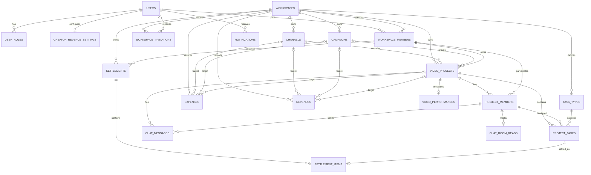
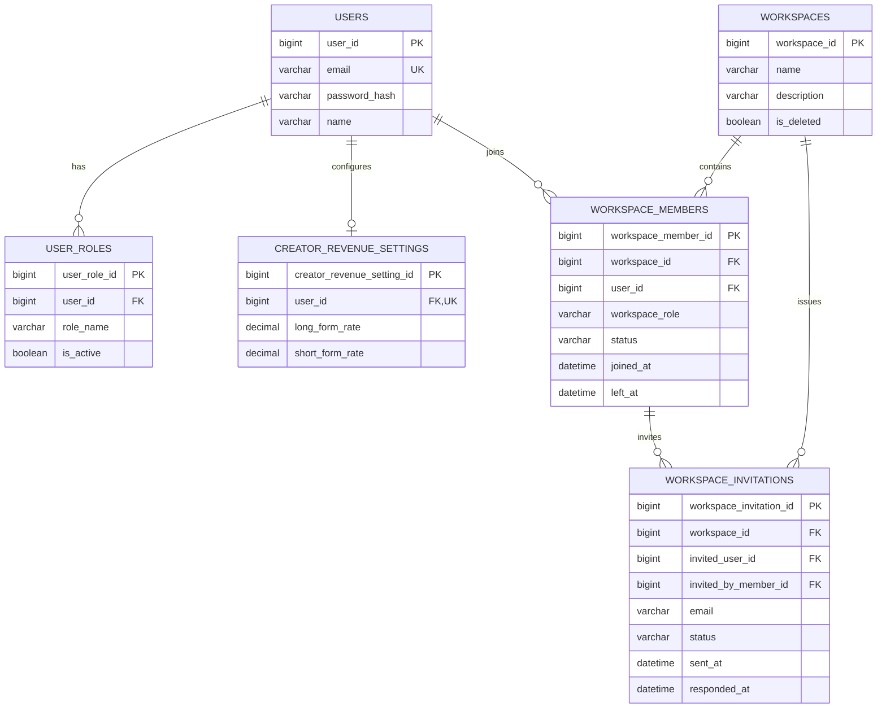
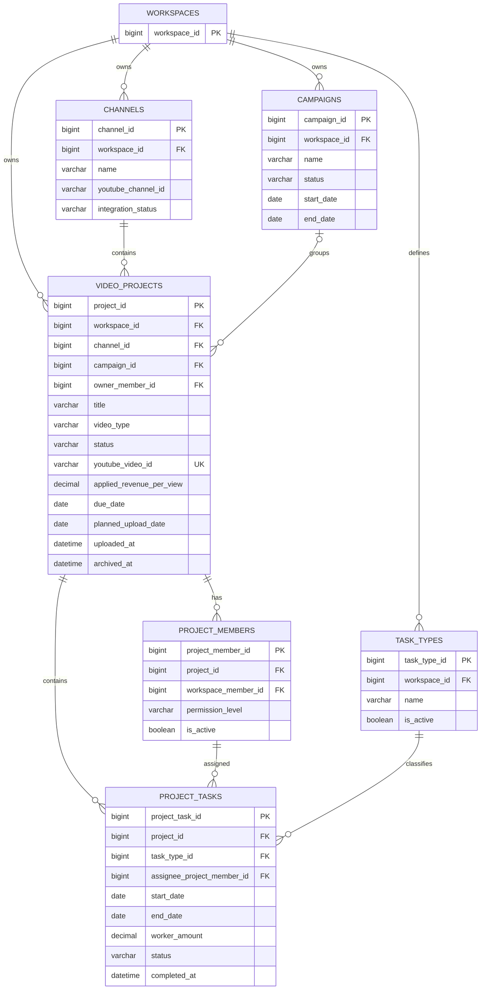
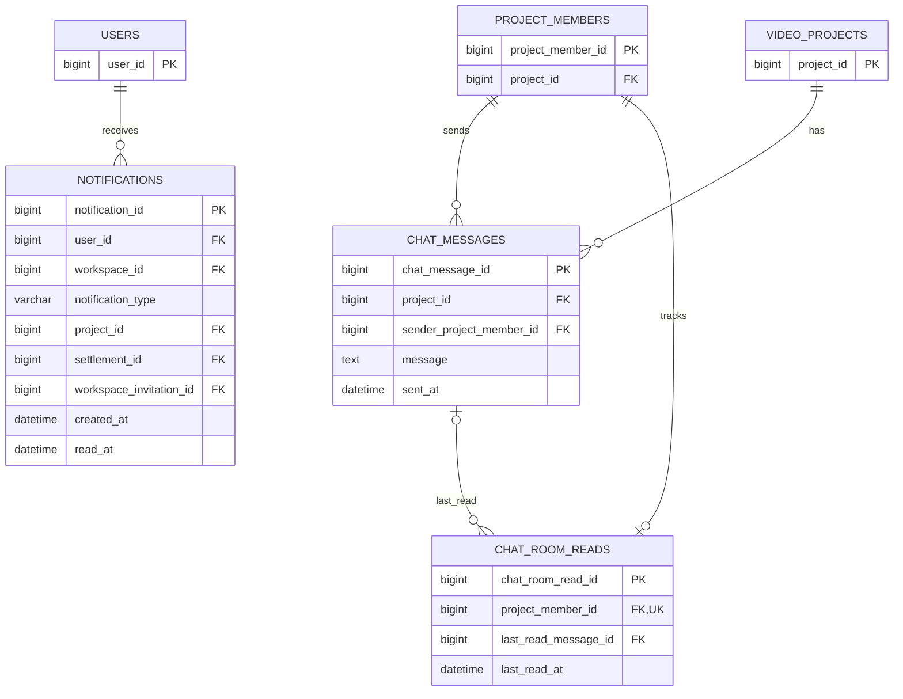
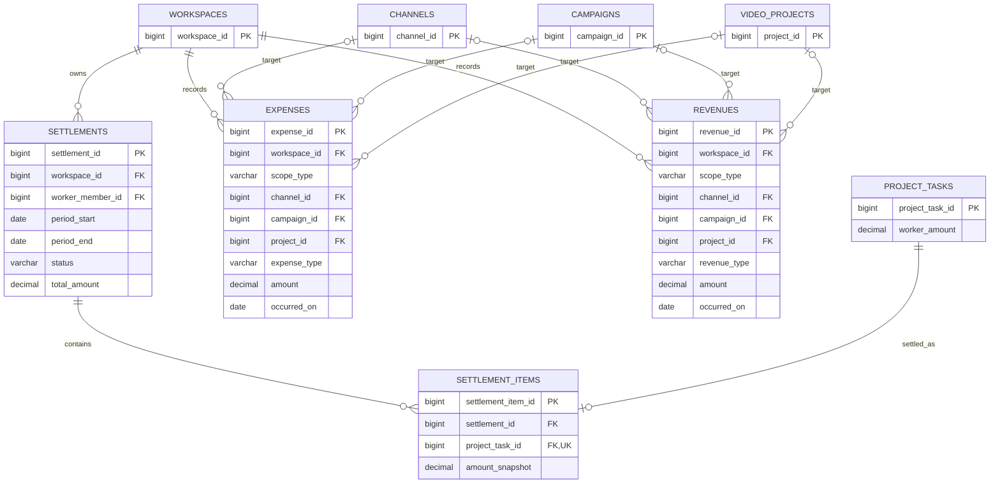
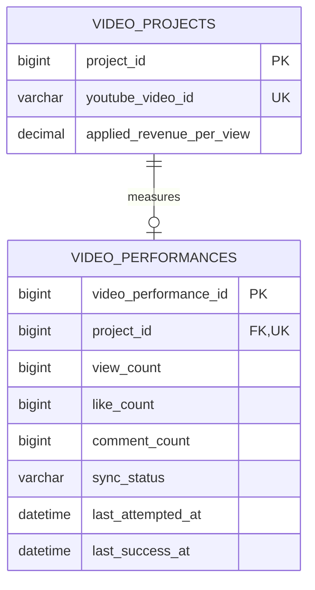

# 데이터베이스 설계 및 ERD

> YMS의 테이블 구조, 관계, 제약조건과 데이터 정책을 정의합니다.  
> 본 문서는 현재 요구사항과 사용자 시나리오를 기준으로 기존 블로그 설계를 전면 재작성한 기준 문서입니다.

## 1. 설계 원칙

YMS의 데이터 구조는 `User → Project` 중심의 초기 구조에서 **Workspace를 업무 데이터의 최상위 경계로 사용하는 구조**로 확장합니다.

핵심 관계는 다음과 같습니다.

```text
User
 └─ Workspace Member
      ├─ Channel
      ├─ Campaign
      │    └─ Project (선택적 연결)
      └─ Project
           ├─ Project Member
           ├─ Task
           ├─ Chat
           └─ YouTube Performance

Workspace
 ├─ Expense
 ├─ Revenue
 └─ Settlement
```

주요 원칙:

- 사용자 전문 역할과 Workspace 권한을 분리합니다.
- Campaign은 Workspace 소속이며 Channel을 직접 소유하지 않습니다.
- Project는 반드시 하나의 Channel에 속하고 Campaign에는 선택적으로 속합니다.
- Campaign과 Project의 관계는 **1:N**이며 하나의 Project가 여러 Campaign에 동시에 속하지 않습니다.
- Project Task의 담당자는 `users`가 아니라 `project_members`를 참조합니다.
- Project 소유자는 `video_projects.owner_member_id`로 명시합니다.
- Expense와 Revenue는 Workspace / Channel / Campaign / Project 중 **한 곳에만 직접 귀속**합니다.
- 실제 Revenue와 조회수 기반 예상 수익을 분리합니다.
- 예상 YouTube 플랫폼 수익은 저장하지 않고 `view_count × applied_revenue_per_view`로 계산합니다.
- 금액과 조회수 1회당 수익 단가는 부동소수점이 아닌 `DECIMAL`을 사용합니다.
- 핵심 관계에는 물리 FK를 적용하고, 동일 Workspace 여부처럼 단일 FK만으로 표현하기 어려운 규칙은 애플리케이션 트랜잭션에서도 재검증합니다.

---

## 2. 마스터 / 트랜잭션 및 감사 정책

### 2.1. 분류 원칙

YMS에서는 데이터 성격을 다음과 같이 구분합니다.

- **Master**: 비교적 장기간 유지되며 다른 업무 데이터의 기준이 되는 사용자, 조직, 채널, 작업 종류 등의 데이터
- **Transaction**: 초대, 캠페인, 프로젝트, 작업, 메시지, 비용, 수익, 정산 등 실제 업무 과정에서 계속 발생하는 데이터

### 2.2. 감사 컬럼 원칙

Master 테이블에는 다음 감사 컬럼을 기본 적용합니다.

| 컬럼 | 타입 | 설명 |
| --- | --- | --- |
| created_by | BIGINT | 최초 등록 사용자 ID. 시스템 또는 자기 자신이 등록하는 경우 NULL 허용 |
| created_at | DATETIME | 최초 등록 시각 |
| updated_by | BIGINT | 마지막 수정 사용자 ID |
| updated_at | DATETIME | 마지막 수정 시각 |

기존 설계처럼 모든 테이블에 `is_deleted`, `deleted_by`, `deleted_at`을 일괄 추가하지 않습니다.

삭제 또는 비활성화가 실제 업무 의미를 가지는 테이블에서만 다음 중 적절한 방식을 선택합니다.

- `is_active`
- 상태값
- `archived_at`
- `deleted_at` / `deleted_by`

Transaction 테이블에는 일반 감사 컬럼을 기본 적용하지 않습니다.

다만 실제 운용에서 반드시 필요한 행위자와 시각은 일반 감사 컬럼이 아니라 **업무 컬럼**으로 유지합니다.

예:

- Workspace 초대: `invited_by_member_id`, `sent_at`, `responded_at`
- 채팅: `sender_project_member_id`, `sent_at`
- 정산: `created_by_member_id`, `confirmed_by_member_id`, `paid_by_member_id`
- 프로젝트 삭제: `deleted_by_member_id`, `deleted_at`
- Expense / Revenue: `recorded_by_member_id`, `recorded_at`, 수정자 / 수정 시각

### 2.3. 테이블별 감사 컬럼 재검토 결과

| 테이블 | 분류 | 일반 감사 컬럼 | 운용 관점 판단 |
| --- | --- | --- | --- |
| users | Master | 적용 | 계정 정보 변경 추적 필요. 단, 회원 탈퇴 정책은 아직 확정하지 않았으므로 탈퇴 상태 컬럼은 추가하지 않음 |
| user_roles | Master | 적용 | 전문 역할 변경이 담당자 검색과 업무 배정에 영향 |
| creator_revenue_settings | Master | 적용 | 기본 단가 변경이 이후 Project 초기값에 영향 |
| workspaces | Master | 적용 | 조직 정보 및 관리 주체 변경 추적 필요 |
| workspace_members | Master | 적용 | OWNER / ADMIN / MEMBER 권한 변경은 추적 가치가 큼 |
| channels | Master | 적용 | 채널 ID 및 연동 상태 변경이 Project와 YouTube 연동에 영향 |
| task_types | Master | 적용 | 작업 종류 추가 / 비활성화 이력 확인 필요 |
| workspace_invitations | Transaction | 미적용 | 초대자, 발송 / 응답 시각이 자체 업무 데이터이므로 별도 감사 컬럼 불필요 |
| campaigns | Transaction | 미적용 | 상태와 기간이 업무 자체를 설명하며 별도 감사 컬럼 필요성이 낮음 |
| video_projects | Transaction | 미적용 | Owner와 업무 상태로 추적. 보관 / 삭제는 별도 라이프사이클 컬럼 유지 |
| project_members | Transaction | 미적용 | 참여 / 제외 시각과 활성 상태로 충분 |
| project_tasks | Transaction | 미적용 | 일정, 상태, 완료 시각이 핵심. 정산 확정 후 금액은 Settlement Item에서 스냅샷 보존 |
| chat_messages | Transaction | 미적용 | 발신자와 전송 시각 자체가 감사 정보 역할 |
| chat_room_reads | Transaction | 미적용 | 현재 읽음 위치를 보관하는 상태 데이터 |
| notifications | Transaction | 미적용 | 생성 시각 / 읽음 시각 자체가 업무 데이터 |
| expenses | Transaction | **최소 추적 예외 적용** | 수동 입력 금액이 ROI에 직접 영향하므로 등록자 / 수정자와 시각 유지 |
| revenues | Transaction | **최소 추적 예외 적용** | 실제 수익 수정은 재무 성과에 직접 영향하므로 등록자 / 수정자와 시각 유지 |
| settlements | Transaction | 미적용 | 생성 / 확정 / 지급 단계별 행위자와 시각을 명시적으로 보관 |
| settlement_items | Transaction | 미적용 | CONFIRMED 시점의 불변 스냅샷 성격 |
| video_performances | Transaction | 미적용 | 외부 API 동기화 상태와 마지막 성공 / 시도 시각이 핵심 |

---

## 3. 전체 테이블 목록

| 도메인 | 테이블 | 설명 |
| --- | --- | --- |
| 사용자 | users | 사용자 계정 및 기본 프로필 |
| 사용자 | user_roles | CREATOR / EDITOR / THUMBNAILER 다중 역할 |
| 사용자 | creator_revenue_settings | CREATOR의 기본 조회수 1회당 수익 단가 |
| Workspace | workspaces | 조직 / 팀 단위 최상위 업무 영역 |
| Workspace | workspace_members | Workspace 참여자 및 권한 |
| Workspace | workspace_invitations | 이메일 기반 Workspace 초대 |
| Channel | channels | Workspace가 관리하는 YouTube 채널 |
| Campaign | campaigns | 여러 Project를 묶는 선택적 상위 업무 단위 |
| Project | video_projects | 영상 제작 프로젝트 |
| Project | project_members | Project 참여자 및 EDIT / VIEW 권한 |
| Task | task_types | Workspace별 확장 가능한 작업 종류 |
| Task | project_tasks | 실제 세부 작업과 담당자 / 일정 / 지급액 |
| Chat | chat_messages | Project 실시간 채팅 메시지 |
| Chat | chat_room_reads | Project별 사용자 마지막 읽음 위치 |
| Notification | notifications | 작업, 채팅, 초대, 정산 알림 |
| Finance | expenses | 실제 제작 비용 |
| Finance | revenues | 실제 발생 수익 |
| Settlement | settlements | 작업자 단위 정산 Header |
| Settlement | settlement_items | 정산에 포함된 Task 금액 스냅샷 |
| YouTube | video_performances | YouTube API 최신 성과 데이터 |

총 20개 테이블을 초기 설계 범위로 정의합니다.

---

# 4. 사용자 도메인

## 4.1. users

사용자 계정과 개인 기본 정보를 관리합니다.

| 컬럼 | 타입 | 제약 | 설명 |
| --- | --- | --- | --- |
| user_id | BIGINT | PK | 사용자 ID |
| email | VARCHAR(255) | NOT NULL, UNIQUE | 로그인 이메일 |
| password_hash | VARCHAR(255) | NOT NULL | 단방향 비밀번호 해시 |
| name | VARCHAR(50) | NOT NULL | 이름 / 닉네임 |
| created_by | BIGINT | NULL | 등록 사용자 ID |
| created_at | DATETIME | NOT NULL | 등록 시각 |
| updated_by | BIGINT | NULL | 마지막 수정 사용자 ID |
| updated_at | DATETIME | NULL | 마지막 수정 시각 |

> 회원 탈퇴 및 탈퇴 이메일 재사용 정책은 현재 요구사항에서 확정하지 않았으므로 `WITHDRAWN`, `is_deleted` 등의 계정 상태는 이번 설계에 포함하지 않습니다.

## 4.2. user_roles

한 사용자가 여러 전문 역할을 동시에 가질 수 있도록 합니다.

| 컬럼 | 타입 | 제약 | 설명 |
| --- | --- | --- | --- |
| user_role_id | BIGINT | PK | 역할 매핑 ID |
| user_id | BIGINT | FK → users | 사용자 |
| role_name | VARCHAR(30) | NOT NULL | CREATOR / EDITOR / THUMBNAILER |
| is_active | BOOLEAN | NOT NULL | 현재 사용 여부 |
| created_by | BIGINT | NULL | 등록 사용자 |
| created_at | DATETIME | NOT NULL | 등록 시각 |
| updated_by | BIGINT | NULL | 수정 사용자 |
| updated_at | DATETIME | NULL | 수정 시각 |

제약:

- `UNIQUE(user_id, role_name)`
- 역할을 다시 선택하는 경우 새 행을 만들기보다 `is_active`를 재활성화합니다.
- 역할명은 애플리케이션 Enum으로 관리합니다.

## 4.3. creator_revenue_settings

CREATOR 개인의 기본 조회수 1회당 예상 수익 단가를 관리합니다.

| 컬럼 | 타입 | 제약 | 설명 |
| --- | --- | --- | --- |
| creator_revenue_setting_id | BIGINT | PK | 설정 ID |
| user_id | BIGINT | FK → users, UNIQUE | CREATOR 사용자 |
| long_form_rate | DECIMAL(12,6) | NOT NULL | 롱폼 조회수 1회당 기본 단가 |
| short_form_rate | DECIMAL(12,6) | NOT NULL | 쇼츠 조회수 1회당 기본 단가 |
| created_by | BIGINT | NULL | 등록 사용자 |
| created_at | DATETIME | NOT NULL | 등록 시각 |
| updated_by | BIGINT | NULL | 수정 사용자 |
| updated_at | DATETIME | NULL | 수정 시각 |

프로필 단가는 Project 생성 시 기본값으로만 사용합니다.

기존 Project의 `applied_revenue_per_view`는 프로필 단가 변경에 의해 자동 수정되지 않습니다.

---

# 5. Workspace 및 Channel 도메인

## 5.1. workspaces

YMS의 업무 데이터가 속하는 최상위 조직 단위입니다.

| 컬럼 | 타입 | 제약 | 설명 |
| --- | --- | --- | --- |
| workspace_id | BIGINT | PK | Workspace ID |
| name | VARCHAR(100) | NOT NULL | Workspace명 |
| description | VARCHAR(500) | NULL | 설명 |
| is_deleted | BOOLEAN | NOT NULL | 논리 삭제 여부 |
| created_by | BIGINT | NULL | 등록 사용자 |
| created_at | DATETIME | NOT NULL | 등록 시각 |
| updated_by | BIGINT | NULL | 수정 사용자 |
| updated_at | DATETIME | NULL | 수정 시각 |
| deleted_by | BIGINT | NULL | 삭제 사용자 |
| deleted_at | DATETIME | NULL | 삭제 시각 |

Workspace 삭제 시 하위 업무 이력까지 즉시 물리 삭제하지 않습니다.

## 5.2. workspace_members

사용자가 Workspace 안에서 가지는 조직 권한을 관리합니다.

| 컬럼 | 타입 | 제약 | 설명 |
| --- | --- | --- | --- |
| workspace_member_id | BIGINT | PK | Workspace 멤버 ID |
| workspace_id | BIGINT | FK → workspaces | Workspace |
| user_id | BIGINT | FK → users | 사용자 |
| workspace_role | VARCHAR(20) | NOT NULL | OWNER / ADMIN / MEMBER |
| status | VARCHAR(20) | NOT NULL | ACTIVE / LEFT / REMOVED |
| joined_at | DATETIME | NOT NULL | 참여 시각 |
| left_at | DATETIME | NULL | 탈퇴 / 제외 시각 |
| created_by | BIGINT | NULL | 등록 사용자 |
| created_at | DATETIME | NOT NULL | 등록 시각 |
| updated_by | BIGINT | NULL | 수정 사용자 |
| updated_at | DATETIME | NULL | 수정 시각 |

제약:

- `UNIQUE(workspace_id, user_id)`
- Workspace에는 항상 최소 한 명의 ACTIVE OWNER가 존재해야 합니다.
- 재참여 시 중복 행을 만들지 않고 기존 멤버 상태를 ACTIVE로 변경합니다.

## 5.3. workspace_invitations

Workspace 초대 흐름을 기록합니다.

| 컬럼 | 타입 | 제약 | 설명 |
| --- | --- | --- | --- |
| workspace_invitation_id | BIGINT | PK | 초대 ID |
| workspace_id | BIGINT | FK → workspaces | 초대 대상 Workspace |
| email | VARCHAR(255) | NOT NULL | 초대 이메일 |
| invited_user_id | BIGINT | FK → users, NULL | 이미 가입된 사용자 또는 가입 후 연결된 사용자 |
| invited_by_member_id | BIGINT | FK → workspace_members | 초대한 OWNER / ADMIN |
| status | VARCHAR(20) | NOT NULL | PENDING / ACCEPTED / REJECTED / CANCELLED |
| sent_at | DATETIME | NOT NULL | 발송 시각 |
| expires_at | DATETIME | NULL | 초대 만료 시각 |
| responded_at | DATETIME | NULL | 수락 / 거절 시각 |

동일 Workspace / 이메일에 PENDING 초대가 중복 생성되지 않도록 애플리케이션에서 검증합니다.

## 5.4. channels

Workspace에서 관리하는 YouTube 채널입니다.

| 컬럼 | 타입 | 제약 | 설명 |
| --- | --- | --- | --- |
| channel_id | BIGINT | PK | Channel ID |
| workspace_id | BIGINT | FK → workspaces | 소속 Workspace |
| name | VARCHAR(150) | NOT NULL | 채널명 |
| youtube_channel_id | VARCHAR(64) | NULL | YouTube Channel ID |
| youtube_channel_url | VARCHAR(255) | NULL | 채널 URL |
| description | VARCHAR(500) | NULL | 설명 |
| integration_status | VARCHAR(20) | NOT NULL | MANUAL / CONNECTED / DISCONNECTED / ERROR |
| is_active | BOOLEAN | NOT NULL | 신규 Project에서 사용 가능 여부 |
| created_by | BIGINT | NULL | 등록 사용자 |
| created_at | DATETIME | NOT NULL | 등록 시각 |
| updated_by | BIGINT | NULL | 수정 사용자 |
| updated_at | DATETIME | NULL | 수정 시각 |

제약:

- `UNIQUE(workspace_id, youtube_channel_id)` 적용을 기본으로 합니다.
- 기존 Project가 연결된 Channel은 물리 삭제보다 비활성화를 우선합니다.
- 수익 기본 단가는 Channel이 아니라 CREATOR 프로필 설정에 둡니다.

---

# 6. Campaign 및 Project 도메인

## 6.1. campaigns

하나의 계약, 프로모션 또는 비즈니스 목적에 속하는 여러 Project를 묶습니다.

| 컬럼 | 타입 | 제약 | 설명 |
| --- | --- | --- | --- |
| campaign_id | BIGINT | PK | Campaign ID |
| workspace_id | BIGINT | FK → workspaces | 소속 Workspace |
| name | VARCHAR(150) | NOT NULL | 캠페인명 |
| description | TEXT | NULL | 설명 |
| start_date | DATE | NULL | 시작일 |
| end_date | DATE | NULL | 종료일 |
| status | VARCHAR(20) | NOT NULL | PLANNING / ACTIVE / COMPLETED / CANCELLED |

Campaign은 Channel FK를 가지지 않습니다.

Project가 연결된 Campaign은 즉시 삭제하지 않고 상태 변경을 우선합니다.

## 6.2. video_projects

영상 제작과 협업의 핵심 Transaction입니다.

| 컬럼 | 타입 | 제약 | 설명 |
| --- | --- | --- | --- |
| project_id | BIGINT | PK | Project ID |
| workspace_id | BIGINT | FK → workspaces | 소속 Workspace |
| channel_id | BIGINT | FK → channels | 담당 Channel |
| campaign_id | BIGINT | FK → campaigns, NULL | 선택적 Campaign |
| owner_member_id | BIGINT | FK → workspace_members | Project 소유자 |
| title | VARCHAR(200) | NOT NULL | 프로젝트 제목 |
| content | TEXT | NULL | 기획 내용 |
| video_type | VARCHAR(20) | NOT NULL | LONG / SHORTS |
| status | VARCHAR(20) | NOT NULL | PLANNING / EDITING / REVIEW / UPLOADED / CANCELLED |
| youtube_video_id | VARCHAR(64) | UNIQUE, NULL | 연결 YouTube Video ID |
| revenue_option | VARCHAR(20) | NOT NULL | DEFAULT / CUSTOM / DISABLED |
| applied_revenue_per_view | DECIMAL(12,6) | NOT NULL | 조회수 1회당 적용 단가 스냅샷 |
| due_date | DATE | NULL | 제작 마감일 |
| planned_upload_date | DATE | NULL | 업로드 예정일 |
| uploaded_at | DATETIME | NULL | 실제 업로드 일시 |
| archived_at | DATETIME | NULL | 보관 시각 |
| deleted_by_member_id | BIGINT | FK → workspace_members, NULL | 삭제 처리 사용자 |
| deleted_at | DATETIME | NULL | 논리 삭제 시각 |

정책:

- Project는 반드시 하나의 Channel에 속합니다.
- Campaign은 선택값이며 한 Project는 최대 하나의 Campaign에만 속합니다.
- `workspace_id`는 Channel을 통해 유추할 수 있지만 tenant 범위 조회와 권한 검증을 위해 명시적으로 유지합니다.
- `owner_member_id`는 동일 Workspace의 ACTIVE 멤버여야 합니다.
- Owner는 `project_members`에도 EDIT 권한 참여자로 등록하는 것을 애플리케이션 규칙으로 둡니다.
- `youtube_video_id`는 중복 연결을 차단합니다.
- 삭제는 하위 Task, Chat, Expense, Revenue 이력을 보존하기 위해 논리 삭제를 사용합니다.
- 보관과 삭제는 Project 진행 상태와 별도입니다.

## 6.3. project_members

Project에 참여하는 Workspace Member와 프로젝트 권한을 관리합니다.

| 컬럼 | 타입 | 제약 | 설명 |
| --- | --- | --- | --- |
| project_member_id | BIGINT | PK | Project 참여자 ID |
| project_id | BIGINT | FK → video_projects | Project |
| workspace_member_id | BIGINT | FK → workspace_members | Workspace 멤버 |
| permission_level | VARCHAR(10) | NOT NULL | EDIT / VIEW |
| is_active | BOOLEAN | NOT NULL | 현재 Project 참여 여부 |
| joined_at | DATETIME | NOT NULL | Project 참여 시각 |
| left_at | DATETIME | NULL | Project 제외 시각 |

제약:

- `UNIQUE(project_id, workspace_member_id)`
- Project와 Workspace Member가 동일 Workspace에 속하는지는 서비스 계층에서 재검증합니다.
- VIEW는 조회 및 채팅 가능, Project / Task 수정 불가입니다.

---

# 7. Task 도메인

## 7.1. task_types

Workspace별 확장 가능한 작업 종류입니다.

| 컬럼 | 타입 | 제약 | 설명 |
| --- | --- | --- | --- |
| task_type_id | BIGINT | PK | 작업 종류 ID |
| workspace_id | BIGINT | FK → workspaces | 소속 Workspace |
| name | VARCHAR(100) | NOT NULL | 가편집, 종합 편집, 자막, 썸네일 등 |
| is_active | BOOLEAN | NOT NULL | 신규 Task에서 선택 가능 여부 |
| created_by | BIGINT | NULL | 등록 사용자 |
| created_at | DATETIME | NOT NULL | 등록 시각 |
| updated_by | BIGINT | NULL | 수정 사용자 |
| updated_at | DATETIME | NULL | 수정 시각 |

제약:

- `UNIQUE(workspace_id, name)`
- 사용된 작업 종류는 삭제하지 않고 비활성화합니다.

## 7.2. project_tasks

Project 안에서 실제 수행하는 세부 작업입니다.

| 컬럼 | 타입 | 제약 | 설명 |
| --- | --- | --- | --- |
| project_task_id | BIGINT | PK | Task ID |
| project_id | BIGINT | FK → video_projects | Project |
| task_type_id | BIGINT | FK → task_types | 작업 종류 |
| assignee_project_member_id | BIGINT | FK → project_members | 담당 Project Member |
| start_date | DATE | NULL | 작업 시작일 |
| end_date | DATE | NULL | 작업 종료일 |
| worker_amount | DECIMAL(15,2) | NOT NULL | 작업자 지급 예정 금액 |
| status | VARCHAR(20) | NOT NULL | WAITING / PROGRESS / REVIEW / COMPLETED |
| completed_at | DATETIME | NULL | 완료 시각 |

정책:

- 담당자는 해당 Project의 ACTIVE `project_members`만 지정할 수 있습니다.
- Task Type과 Project가 동일 Workspace에 속하는지는 서비스 계층에서 검증합니다.
- `end_date < start_date`는 허용하지 않습니다.
- Project `due_date` 이후의 종료일은 차단하지 않고 경고합니다.
- REVIEW 반려 시 동일 Task를 PROGRESS로 되돌립니다.
- `worker_amount`는 Project 제작비와 정산의 원천 금액입니다.
- CONFIRMED 정산에 포함된 이후 실제 지급 기준 금액은 `settlement_items.amount_snapshot`을 사용합니다.

---

# 8. Chat 및 Notification 도메인

## 8.1. chat_messages

Project별 실시간 메시지를 저장합니다.

| 컬럼 | 타입 | 제약 | 설명 |
| --- | --- | --- | --- |
| chat_message_id | BIGINT | PK | 메시지 ID |
| project_id | BIGINT | FK → video_projects | 채팅방 역할을 하는 Project |
| sender_project_member_id | BIGINT | FK → project_members | 발신 Project Member |
| message | TEXT | NOT NULL | 메시지 본문 |
| sent_at | DATETIME | NOT NULL | 전송 시각 |

별도의 `chat_rooms` 테이블은 두지 않고 **Project 1개 = Chat Room 1개**로 간주합니다.

## 8.2. chat_room_reads

Project Member별 마지막 읽음 위치를 관리합니다.

| 컬럼 | 타입 | 제약 | 설명 |
| --- | --- | --- | --- |
| chat_room_read_id | BIGINT | PK | 읽음 상태 ID |
| project_member_id | BIGINT | FK → project_members, UNIQUE | Project 참여자 |
| last_read_message_id | BIGINT | FK → chat_messages, NULL | 마지막으로 확인한 메시지 |
| last_read_at | DATETIME | NULL | 마지막 확인 시각 |

`project_member_id` 자체가 Project와 User 관계를 표현하므로 별도 `project_id`를 중복 저장하지 않습니다.

## 8.3. notifications

사용자별 알림과 읽음 상태를 관리합니다.

| 컬럼 | 타입 | 제약 | 설명 |
| --- | --- | --- | --- |
| notification_id | BIGINT | PK | 알림 ID |
| user_id | BIGINT | FK → users | 수신 사용자 |
| workspace_id | BIGINT | FK → workspaces, NULL | 관련 Workspace |
| notification_type | VARCHAR(40) | NOT NULL | TASK_UPDATE / NEW_CHAT / WORKSPACE_INVITATION / SETTLEMENT_UPDATE 등 |
| actor_user_id | BIGINT | FK → users, NULL | 알림을 발생시킨 사용자 |
| project_id | BIGINT | FK → video_projects, NULL | 관련 Project |
| settlement_id | BIGINT | FK → settlements, NULL | 관련 Settlement |
| workspace_invitation_id | BIGINT | FK → workspace_invitations, NULL | 관련 초대 |
| message_summary | VARCHAR(500) | NOT NULL | 화면 표시 요약 |
| created_at | DATETIME | NOT NULL | 알림 발생 시각 |
| read_at | DATETIME | NULL | 읽음 시각 |

`read_at IS NULL`이면 읽지 않은 알림으로 판단합니다.

---

# 9. 비용 및 수익 도메인

## 9.1. 공통 귀속 규칙

Expense와 Revenue는 항상 `workspace_id`를 보유하고, 실제 직접 귀속 대상은 다음 중 하나만 선택합니다.

- WORKSPACE
- CHANNEL
- CAMPAIGN
- PROJECT

공통 구조:

```text
scope_type = WORKSPACE
→ channel_id / campaign_id / project_id 모두 NULL

scope_type = CHANNEL
→ channel_id만 값 존재

scope_type = CAMPAIGN
→ campaign_id만 값 존재

scope_type = PROJECT
→ project_id만 값 존재
```

DB의 CHECK 제약과 서비스 계층 검증을 함께 사용합니다.

Channel / Campaign / Project가 `workspace_id`와 동일 Workspace에 속하는지도 서비스 계층에서 재검증합니다.

## 9.2. expenses

작업자 지급액 외에 실제 콘텐츠 제작에 발생한 비용을 관리합니다.

| 컬럼 | 타입 | 제약 | 설명 |
| --- | --- | --- | --- |
| expense_id | BIGINT | PK | Expense ID |
| workspace_id | BIGINT | FK → workspaces | 소속 Workspace |
| scope_type | VARCHAR(20) | NOT NULL | WORKSPACE / CHANNEL / CAMPAIGN / PROJECT |
| channel_id | BIGINT | FK → channels, NULL | Channel 직접 귀속 시 사용 |
| campaign_id | BIGINT | FK → campaigns, NULL | Campaign 직접 귀속 시 사용 |
| project_id | BIGINT | FK → video_projects, NULL | Project 직접 귀속 시 사용 |
| expense_type | VARCHAR(50) | NOT NULL | 장소, 장비, 출연료, 라이선스, 외주, 광고비, 기타 등 |
| amount | DECIMAL(15,2) | NOT NULL | 실제 비용 |
| occurred_on | DATE | NOT NULL | 비용 발생일 |
| memo | VARCHAR(500) | NULL | 메모 |
| recorded_by_member_id | BIGINT | FK → workspace_members | 최초 입력자 |
| recorded_at | DATETIME | NOT NULL | 최초 입력 시각 |
| updated_by_member_id | BIGINT | FK → workspace_members, NULL | 마지막 수정자 |
| updated_at | DATETIME | NULL | 마지막 수정 시각 |

`expense_type`은 DB ENUM으로 고정하지 않고 확장 가능한 문자열 코드로 관리합니다.

Task의 `worker_amount`는 이미 Project 비용에 포함되므로 동일 금액을 Expense로 다시 입력하지 않습니다.

## 9.3. revenues

실제로 발생했거나 확정된 수익을 관리합니다.

| 컬럼 | 타입 | 제약 | 설명 |
| --- | --- | --- | --- |
| revenue_id | BIGINT | PK | Revenue ID |
| workspace_id | BIGINT | FK → workspaces | 소속 Workspace |
| scope_type | VARCHAR(20) | NOT NULL | WORKSPACE / CHANNEL / CAMPAIGN / PROJECT |
| channel_id | BIGINT | FK → channels, NULL | Channel 직접 귀속 시 사용 |
| campaign_id | BIGINT | FK → campaigns, NULL | Campaign 직접 귀속 시 사용 |
| project_id | BIGINT | FK → video_projects, NULL | Project 직접 귀속 시 사용 |
| revenue_type | VARCHAR(50) | NOT NULL | YOUTUBE_PLATFORM / SPONSORSHIP / AFFILIATE / MERCHANDISE / MEMBERSHIP / OTHER |
| amount | DECIMAL(15,2) | NOT NULL | 실제 수익 |
| occurred_on | DATE | NOT NULL | 수익 발생일 또는 정산 기준일 |
| memo | VARCHAR(500) | NULL | 메모 |
| recorded_by_member_id | BIGINT | FK → workspace_members | 최초 입력자 |
| recorded_at | DATETIME | NOT NULL | 최초 입력 시각 |
| updated_by_member_id | BIGINT | FK → workspace_members, NULL | 마지막 수정자 |
| updated_at | DATETIME | NULL | 마지막 수정 시각 |

조회수 1회당 단가로 계산한 예상 플랫폼 수익은 이 테이블에 저장하지 않습니다.

`revenues`에는 실제 재무 성과 계산에 사용할 금액만 기록합니다.

---

# 10. Settlement 도메인

## 10.1. settlements

작업자별 정산 Header입니다.

| 컬럼 | 타입 | 제약 | 설명 |
| --- | --- | --- | --- |
| settlement_id | BIGINT | PK | Settlement ID |
| workspace_id | BIGINT | FK → workspaces | 소속 Workspace |
| worker_member_id | BIGINT | FK → workspace_members | 정산 대상 작업자 |
| period_start | DATE | NOT NULL | 정산 시작일 |
| period_end | DATE | NOT NULL | 정산 종료일 |
| status | VARCHAR(20) | NOT NULL | DRAFT / CONFIRMED / PAID |
| total_amount | DECIMAL(15,2) | NOT NULL | 정산 총액 |
| created_by_member_id | BIGINT | FK → workspace_members | DRAFT 생성 사용자 |
| created_at | DATETIME | NOT NULL | 정산 생성 시각 |
| confirmed_by_member_id | BIGINT | FK → workspace_members, NULL | 확정 사용자 |
| confirmed_at | DATETIME | NULL | 확정 시각 |
| paid_by_member_id | BIGINT | FK → workspace_members, NULL | 지급 완료 처리 사용자 |
| paid_at | DATETIME | NULL | 지급 완료 시각 |

정책:

- DRAFT에서는 Task 정보 기준으로 재계산할 수 있습니다.
- CONFIRMED 시점부터 금액을 고정합니다.
- PAID는 일반 수정 대상이 아닙니다.
- 실제 계좌이체 기능은 수행하지 않고 지급 완료 여부만 기록합니다.

## 10.2. settlement_items

정산에 포함된 개별 Task와 확정 금액을 보존합니다.

| 컬럼 | 타입 | 제약 | 설명 |
| --- | --- | --- | --- |
| settlement_item_id | BIGINT | PK | Settlement Item ID |
| settlement_id | BIGINT | FK → settlements | Settlement Header |
| project_task_id | BIGINT | FK → project_tasks, UNIQUE | 정산 대상 Task |
| amount_snapshot | DECIMAL(15,2) | NOT NULL | 확정 시점 지급 금액 스냅샷 |

정책:

- DRAFT 재계산 시 Item은 다시 생성하거나 갱신할 수 있습니다.
- CONFIRMED 이후 Item과 `amount_snapshot`은 변경하지 않습니다.
- `UNIQUE(project_task_id)`로 동일 Task의 중복 정산을 차단합니다.
- Settlement 지급은 Project Expense를 새로 생성하지 않습니다. Task 지급액은 이미 제작비에 포함되므로 이중 집계를 방지합니다.

---

# 11. YouTube 성과 도메인

## 11.1. video_performances

YouTube API에서 마지막으로 성공적으로 동기화한 Project의 콘텐츠 성과를 저장합니다.

| 컬럼 | 타입 | 제약 | 설명 |
| --- | --- | --- | --- |
| video_performance_id | BIGINT | PK | 성과 ID |
| project_id | BIGINT | FK → video_projects, UNIQUE | 연결 Project |
| view_count | BIGINT | NOT NULL | 최신 누적 조회수 |
| like_count | BIGINT | NULL | 최신 좋아요 수 |
| comment_count | BIGINT | NULL | 최신 댓글 수 |
| sync_status | VARCHAR(20) | NOT NULL | SUCCESS / ERROR |
| last_attempted_at | DATETIME | NULL | 마지막 동기화 시도 시각 |
| last_success_at | DATETIME | NULL | 마지막 성공 시각 |
| last_error_message | VARCHAR(500) | NULL | 마지막 오류 요약 |

예상 YouTube 플랫폼 수익은 다음 값으로 조회 시 계산합니다.

```text
예상 YouTube 플랫폼 수익
= video_performances.view_count
× video_projects.applied_revenue_per_view
```

따라서 기존 설계의 `calculated_revenue` 컬럼은 제거합니다.

조회수 변화 이력 그래프가 필요해질 경우 초기 테이블을 비대하게 만들지 않고 향후 `video_performance_snapshots`를 별도로 추가합니다.

---

# 12. 주요 무결성 및 인덱스 정책

## 12.1. Workspace 경계 검증

다음 관계는 FK만으로는 "같은 Workspace인가"를 완전히 표현하기 어렵기 때문에 서비스 계층에서 반드시 재검증합니다.

- Project의 `channel_id`
- Project의 `campaign_id`
- Project의 `owner_member_id`
- Project Member의 `workspace_member_id`
- Task의 `task_type_id`
- Expense / Revenue의 Channel / Campaign / Project 대상
- Settlement의 `worker_member_id`

모든 쓰기 API는 현재 인증 사용자의 Workspace 권한과 대상 데이터의 Workspace ID를 함께 검증합니다.

## 12.2. 주요 UNIQUE 제약

- `users.email`
- `user_roles(user_id, role_name)`
- `creator_revenue_settings.user_id`
- `workspace_members(workspace_id, user_id)`
- `channels(workspace_id, youtube_channel_id)`
- `task_types(workspace_id, name)`
- `video_projects.youtube_video_id`
- `project_members(project_id, workspace_member_id)`
- `chat_room_reads.project_member_id`
- `settlement_items.project_task_id`
- `video_performances.project_id`

## 12.3. 권장 조회 인덱스

실제 쿼리 작성 단계에서 EXPLAIN으로 검증하는 것을 전제로 다음 인덱스를 우선 검토합니다.

- `workspace_members(workspace_id, status)`
- `video_projects(workspace_id, status, archived_at)`
- `video_projects(channel_id, status)`
- `video_projects(campaign_id, status)`
- `project_tasks(project_id, status)`
- `project_tasks(assignee_project_member_id, end_date, status)`
- `chat_messages(project_id, chat_message_id)`
- `notifications(user_id, read_at, created_at)`
- `expenses(workspace_id, occurred_on, scope_type)`
- `revenues(workspace_id, occurred_on, scope_type)`
- `settlements(workspace_id, worker_member_id, period_start, period_end)`

---

# 13. 전체 개념 ERD

아래 ERD는 컬럼을 생략하고 핵심 관계만 보여줍니다.



---

# 14. 도메인별 상세 ERD

## 14.1. 사용자 / Workspace



## 14.2. Channel / Campaign / Project / Task



## 14.3. Chat / Notification



## 14.4. Expense / Revenue / Settlement



## 14.5. YouTube Performance



---

# 15. 집계 및 파생 데이터 정책

다음 값은 중복 저장하지 않고 조회 또는 서비스 계층에서 계산합니다.

## Project 실제 비용

```text
Project 실제 비용
= Project Task의 worker_amount 합계
+ Project에 직접 귀속된 Expense 합계
```

## Project 실제 수익

```text
Project 실제 수익
= Project에 직접 귀속된 Revenue 합계
```

## Campaign 실제 비용

```text
Campaign 실제 비용
= Campaign 직접 Expense
+ 연결 Project Task의 worker_amount
+ 연결 Project 직접 Expense
```

## Campaign 실제 수익

```text
Campaign 실제 수익
= Campaign 직접 Revenue
+ 연결 Project 직접 Revenue
```

Channel 또는 Workspace에 직접 귀속된 Expense / Revenue는 Campaign 또는 Project에 임의 배분하지 않습니다.

## 재무 성과

```text
손익 = 실제 수익 - 실제 비용

ROI = (실제 수익 - 실제 비용) ÷ 실제 비용 × 100

수익/비용 배수 = 실제 수익 ÷ 실제 비용
```

실제 비용이 0원인 경우 ROI는 계산하지 않습니다.

## YouTube 예상 플랫폼 수익

```text
예상 플랫폼 수익
= 최신 view_count
× Project의 applied_revenue_per_view
```

예상 플랫폼 수익은 실제 Revenue가 아니며 실제 ROI 계산에 포함하지 않습니다.

---

# 16. 기존 설계에서의 주요 변경사항

초기 블로그 설계와 비교한 핵심 변경은 다음과 같습니다.

- `users → project` 중심 구조에서 **Workspace 중심 구조**로 변경
- `user_channel_config`를 제거하고 개인 기본 단가를 `creator_revenue_settings`로 분리
- 실제 Channel 엔티티인 `channels` 추가
- Workspace 권한을 위한 `workspace_members` 추가
- 미가입 사용자 초대를 포함한 `workspace_invitations` 추가
- Campaign 1:N Project 구조의 `campaigns` 추가
- Project에 `workspace_id`, `channel_id`, `campaign_id`, `owner_member_id` 추가
- Project 보관과 삭제를 진행 상태와 분리
- `project_assignments`를 실제 의미에 맞게 `project_tasks`로 변경
- Task 담당 FK를 `user_id`에서 `project_member_id`로 변경
- 고정 `task_type` 문자열 대신 Workspace별 `task_types` 추가
- 채팅 발신자를 `project_member_id` 기준으로 변경
- 알림 저장을 위한 `notifications` 추가
- 작업자 지급액 이외의 제작비를 위한 `expenses` 추가
- 협찬, 제휴, 상품 판매 등 실제 수익을 위한 `revenues` 추가
- Expense / Revenue의 단일 귀속 규칙 확정
- `settlements`를 Header로 재설계하고 `settlement_items` 추가
- 정산 CONFIRMED 시 Task 지급액 스냅샷 보존
- `video_performances.calculated_revenue` 제거
- 조회수 1회당 단가를 `applied_revenue_per_view`로 명확화
- 예상 수익은 파생값, 실제 Revenue와 분리
- 모든 테이블에 일괄 적용하던 감사 / Soft Delete 컬럼 정책을 데이터 성격에 따라 분리

이 구조를 이후 REST API 명세와 JPA Entity 설계의 기준으로 사용합니다.
