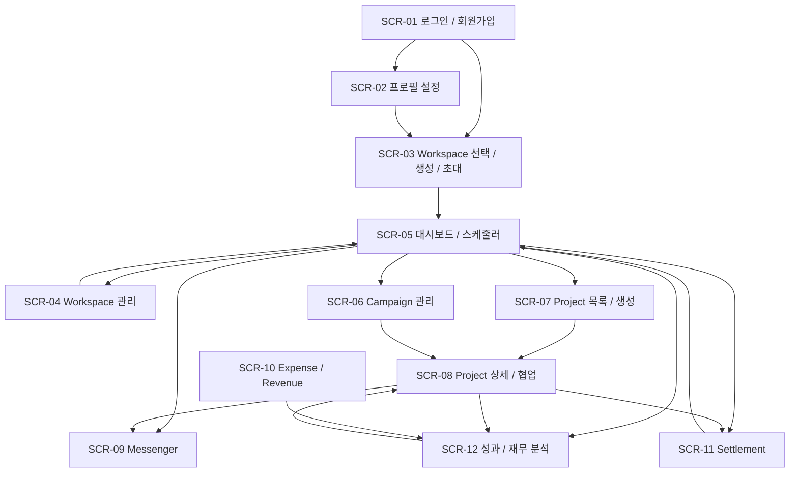

# 화면 설계

> YMS의 전체 화면 목록과 각 화면의 목적, 접근 권한, 핵심 UI 컴포넌트를 정의합니다.  
> 본 문서는 요구사항 및 사용자 시나리오를 화면 단위로 구체화한 기준 문서입니다.

## 1. 화면 설계 원칙

YMS는 **크리에이터와 편집자·썸네일 작업자 사이의 제작 협업**을 기본 가치로 하며, OWNER와 ADMIN에게는 콘텐츠 제작 비용과 실제 수익을 연결하여 성과를 분석하는 운영 기능을 추가로 제공합니다.

따라서 모든 사용자가 동일한 메뉴와 재무 정보를 보는 구조로 설계하지 않습니다.

- 일반 작업자는 자신에게 필요한 프로젝트, 작업, 일정, 채팅, 알림과 개인 정산 정보를 우선 확인합니다.
- OWNER와 ADMIN은 워크스페이스 운영, 채널, 캠페인, 비용, 수익, 전체 정산과 재무 분석 기능에 접근할 수 있습니다.
- 프로젝트의 EDIT / VIEW 권한은 프로젝트 협업 범위를 결정하며 워크스페이스 전체 재무 정보 접근 권한을 의미하지 않습니다.
- Workspace는 로그인 이후 대부분의 화면에서 현재 작업 범위를 결정하는 기준 컨텍스트로 사용합니다.
- 데스크톱과 모바일에서 동일한 핵심 기능을 제공하되, 모바일에서는 카드·목록 중심의 세로형 레이아웃을 우선합니다.

---

## 2. 공통 레이아웃 및 공통 UI

인증 이후 화면은 공통 `MainLayout`을 사용합니다.

### 공통 헤더

- YMS 로고
- 현재 Workspace 표시 및 전환
- 주요 화면 이동 메뉴
- 읽지 않은 알림 배지
- 사용자 프로필 메뉴

### 공통 알림 Drawer

별도의 전체 화면으로 분리하지 않고 모든 인증 화면에서 열 수 있는 Drawer 또는 Popover 형태로 제공합니다.

표시 대상:

- 새 작업 배정
- 작업 상태 변경 및 검수 요청
- 프로젝트 채팅 메시지
- 워크스페이스 초대
- 개인 정산 상태 변경

기능:

- 전체 / 읽지 않음 필터
- 최근 알림 목록
- 읽음 처리
- 관련 프로젝트 또는 화면 이동

### 공통 반응형 원칙

- 데스크톱: 좌우 분할, 테이블, 월간 캘린더 등 넓은 화면 활용
- 모바일: 카드, 주간 일정 또는 Agenda View, 단일 컬럼 중심
- 수정 권한이 없는 사용자는 단순히 버튼을 숨기는 것에 그치지 않고 서버에서도 권한을 검증합니다.

---

## 3. 전체 화면 목록

| 화면 ID | 화면명 | 주요 사용자 | 핵심 목적 |
| --- | --- | --- | --- |
| SCR-01 | 로그인 / 회원가입 | 비인증 사용자 | 계정 생성 및 로그인 |
| SCR-02 | 프로필 설정 | 인증 사용자 | 전문 역할 및 개인 기본 설정 |
| SCR-03 | 워크스페이스 선택 / 생성 / 초대 | 인증 사용자 | 사용할 Workspace 진입 |
| SCR-04 | 워크스페이스 관리 | OWNER, ADMIN | 멤버와 채널 관리 |
| SCR-05 | 메인 대시보드 및 스케줄러 | Workspace 멤버 | 개인 업무와 전체 일정 확인 |
| SCR-06 | 캠페인 관리 | OWNER, ADMIN | 여러 프로젝트를 캠페인 단위로 관리 |
| SCR-07 | 프로젝트 목록 / 생성 / 보관함 | Workspace 멤버 | 프로젝트 탐색 및 생성 |
| SCR-08 | 프로젝트 상세 및 협업 | 프로젝트 참여자, 관리 권한 사용자 | 작업, 검수, 권한, YouTube 연결 등 프로젝트 업무 수행 |
| SCR-09 | 실시간 협업 메신저 | 프로젝트 참여자 | 참여 프로젝트의 채팅 통합 관리 |
| SCR-10 | 비용 / 수익 관리 | OWNER, ADMIN | Expense와 Revenue 등록 및 조회 |
| SCR-11 | 작업자 정산 | OWNER, ADMIN, 작업자 본인 | 정산 확정 및 개인 지급 현황 확인 |
| SCR-12 | 콘텐츠 성과 및 재무 분석 | OWNER, ADMIN | Project / Campaign 중심 실제 재무 성과 분석 |

---

# SCR-01. 로그인 / 회원가입

> 와이어프레임: [GitHub Pages에서 보기](https://heebaek200.github.io/yms-project/design/wireframes/scr-01-auth.html)

## 목적

사용자가 YMS 계정을 생성하거나 기존 계정으로 로그인합니다.

## 접근 권한

- 모든 비인증 사용자
- 인증 완료 사용자는 기본 진입 화면으로 이동

## 핵심 컴포넌트

### 로그인 탭

- 이메일 입력
- 비밀번호 입력
- 로그인 버튼
- 입력값 오류 메시지

### 회원가입 탭

- 이메일 입력
- 비밀번호 입력
- 비밀번호 확인
- 이름 또는 닉네임
- 회원가입 버튼
- 입력값 오류 메시지

### 추후 확장 영역

- Google 로그인 버튼
- 기타 소셜 로그인 버튼

초기 릴리스에서는 소셜 로그인 버튼을 비활성 상태로 표시하거나 UI에서 제외할 수 있습니다.

## 주요 상태 및 검증

- 이메일 형식 오류
- 비밀번호 길이 및 허용 형식 오류
- 비밀번호 확인 불일치
- 이미 사용 중인 이메일
- 로그인 실패
- 인증 만료

## 화면 이동

```text
회원가입 성공
    ↓
SCR-02 프로필 설정

로그인 성공
    ↓
SCR-03 워크스페이스 선택 / 생성 / 초대
```

---

# SCR-02. 프로필 설정

> 와이어프레임: [GitHub Pages에서 보기](https://heebaek200.github.io/yms-project/design/wireframes/scr-02-profile.html)

## 목적

사용자가 자신이 수행할 수 있는 전문 역할과 개인 기본 정보를 설정합니다.

CREATOR 역할 사용자는 YouTube 플랫폼 예상 수익 계산에 사용할 기본 조회수 1회당 수익 단가를 설정할 수 있습니다.

## 접근 권한

- 인증된 사용자
- 자신의 프로필만 수정 가능

## 핵심 컴포넌트

### 기본 프로필

- 이메일 표시
- 이름 / 닉네임 입력

### 전문 역할 선택

복수 선택 가능:

- CREATOR
- EDITOR
- THUMBNAILER

### CREATOR 전용 수익 단가 설정

CREATOR 역할을 선택한 경우에만 표시합니다.

- 롱폼 기본 조회수 1회당 수익 단가
- 쇼츠 기본 조회수 1회당 수익 단가
- 기존 미확정 프로젝트 적용 범위 선택
  - 향후 프로젝트만
  - 기존 미확정 프로젝트에도 적용

프로필의 단가는 프로젝트 생성 시 사용할 기본값이며 프로젝트에 실제 적용된 단가는 별도로 저장합니다.

## 주요 상태 및 검증

- 전문 역할 미선택
- 음수 또는 숫자가 아닌 단가
- 허용 범위를 벗어난 단가
- CREATOR 역할 해제 시 단가 입력 영역 숨김
- 기본 단가 변경 시 기존 프로젝트 자동 변경 금지

## 화면 이동

설정 완료 후 SCR-03으로 이동합니다.

---

# SCR-03. 워크스페이스 선택 / 생성 / 초대

> 와이어프레임: [GitHub Pages에서 보기](https://heebaek200.github.io/yms-project/design/wireframes/scr-03-workspace.html)

## 목적

사용자가 참여 중인 Workspace를 선택하거나 새 Workspace를 만들고, 자신에게 도착한 초대를 처리합니다.

YMS의 주요 업무 화면은 Workspace를 선택한 이후 진입합니다.

## 접근 권한

- 인증된 모든 사용자

## 핵심 컴포넌트

### 참여 Workspace 목록

각 카드에 다음 정보를 표시합니다.

- Workspace명
- 자신의 권한: OWNER / ADMIN / MEMBER
- 참여 중인 프로젝트 수
- 최근 접근 시각 또는 최근 활동

### Workspace 생성

- 새 Workspace 생성 버튼
- Workspace명 입력
- 설명 등 기본 정보 입력

생성한 사용자는 자동으로 OWNER가 됩니다.

### 초대 목록

- 초대받은 Workspace명
- 초대한 사용자
- 초대 상태
- 수락
- 거절

## 주요 상태 및 검증

- 유효하지 않거나 취소된 초대
- 이미 참여 중인 Workspace 초대
- 가입 전 이메일로 발송된 초대 연결
- 참여 가능한 Workspace가 없는 사용자

## 화면 이동

Workspace를 선택하면 SCR-05 메인 대시보드로 이동합니다.

---

# SCR-04. 워크스페이스 관리

> 와이어프레임: [GitHub Pages에서 보기](https://heebaek200.github.io/yms-project/design/wireframes/scr-04-workspace-admin.html)

## 목적

Workspace의 멤버와 YouTube 채널을 관리합니다.

Workspace 관리 기능과 프로젝트 협업 기능을 분리하여 일반 작업자에게 불필요한 관리 UI가 노출되지 않도록 합니다.

## 접근 권한

- OWNER
- ADMIN

일반 MEMBER는 접근할 수 없습니다.

## 핵심 컴포넌트

### 멤버 관리 탭

- 멤버 목록
- 이름
- 이메일
- 전문 역할
- Workspace 권한
- 초대 상태
- 권한 변경
- 멤버 제외
- 새 멤버 초대

### 멤버 초대 모달

- 이메일 입력
- 초대 발송
- 대기 중 초대 목록
- 초대 재전송
- 초대 취소

### 채널 관리 탭

- 등록 채널 목록
- 채널명
- YouTube Channel ID / URL
- 설명
- YouTube 연동 상태
- 채널 추가
- 채널 수정

### 작업 종류 관리 영역

확장 가능한 Task Type을 Workspace에서 관리합니다.

- 기본 작업 종류
- 사용자 정의 작업 종류
- 새 작업 종류 추가
- 사용 여부 활성 / 비활성

비활성화된 작업 종류는 신규 작업 생성 목록에서 제외하되 기존 작업 이력에는 유지합니다.

## 주요 상태 및 검증

- 마지막 OWNER의 권한 변경 또는 제거 차단
- 이미 참여 중인 멤버 재초대 차단
- 취소된 초대 처리
- 다른 Workspace 리소스 접근 차단
- 프로젝트에서 사용 중인 채널 삭제 정책 확인

---

# SCR-05. 메인 대시보드 및 스케줄러

> 와이어프레임: [GitHub Pages에서 보기](https://heebaek200.github.io/yms-project/design/wireframes/scr-05-dashboard.html)

## 목적

사용자가 로그인 후 가장 자주 확인하는 업무 화면입니다.

현재 Workspace에서 자신의 작업, 프로젝트 일정, 검수 요청, 마감 임박 업무와 알림을 한눈에 확인합니다.

## 접근 권한

- 현재 Workspace의 모든 멤버

사용자의 권한에 따라 카드와 관리 기능의 노출 범위를 다르게 구성합니다.

## 핵심 컴포넌트

### 요약 카드

공통 또는 사용자 중심:

- 진행 중 프로젝트 수
- 내가 담당한 마감 예정 작업 수
- 검수 요청 작업 수
- 마감 임박 작업 수

일반 작업자는 자신의 작업 중심으로 표시합니다.

OWNER / ADMIN은 Workspace 운영 현황과 SCR-12 분석 화면으로 이동할 수 있는 링크를 추가로 제공합니다.

### 스케줄러

데스크톱:

- 월간 Calendar View
- Task 기간 Bar 표시

모바일:

- 주간 Calendar 또는 Agenda View
- 날짜별 작업 목록

### FilterBar

- 조회 기간
- 프로젝트 상태
- 전문 역할
- 내 작업만 보기
- 채널
- 프로젝트 / 작업 키워드 검색

### 업무 및 알림 피드

- 오늘 마감 작업
- 마감 임박 작업
- 검수 요청
- 최근 알림

## 주요 상태 및 검증

- 조회 결과 없음
- 필터 조합 결과 없음
- 권한에 따라 다른 프로젝트 노출
- 보관된 프로젝트의 기본 일정 제외
- CANCELLED 프로젝트의 기본 일정 제외

## 화면 이동

- 일정 선택 → SCR-08 프로젝트 상세
- 새 프로젝트 → SCR-07 프로젝트 생성
- 알림 선택 → 관련 프로젝트 또는 정산 화면

---

# SCR-06. 캠페인 관리

> 와이어프레임: [GitHub Pages에서 보기](https://heebaek200.github.io/yms-project/design/wireframes/scr-06-campaign.html)

## 목적

여러 영상 프로젝트를 하나의 계약, 프로모션 또는 비즈니스 목적 단위로 묶어 관리합니다.

Campaign은 Workspace 소속이며 특정 Channel을 직접 소유하지 않습니다.

## 접근 권한

- OWNER
- ADMIN

## 핵심 컴포넌트

### 캠페인 목록

- 캠페인명
- 상태
- 시작일
- 종료일
- 연결 프로젝트 수
- 실제 비용 요약
- 실제 수익 요약

### 필터

- 상태
- 기간
- 키워드

### 캠페인 생성 / 수정 모달

- 캠페인명
- 설명
- 시작일
- 종료일
- 상태
  - PLANNING
  - ACTIVE
  - COMPLETED
  - CANCELLED

### 캠페인 상세 영역

- 연결된 프로젝트 목록
- 각 프로젝트의 채널
- 각 프로젝트 상태
- 캠페인 직접 Expense 요약
- 캠페인 직접 Revenue 요약
- 콘텐츠 가치 분석 바로가기

## 주요 상태 및 검증

- 하나의 프로젝트는 최대 하나의 Campaign에만 연결
- Campaign 없이 존재하는 Project 허용
- 서로 다른 Channel의 Project를 하나의 Campaign에 포함 가능
- Project가 연결된 Campaign의 즉시 삭제 제한
- 완료 또는 취소 Campaign의 이력 보존

## 화면 이동

- 프로젝트 선택 → SCR-08
- 성과 분석 → SCR-12

---

# SCR-07. 프로젝트 목록 / 생성 / 보관함

> 와이어프레임: [GitHub Pages에서 보기](https://heebaek200.github.io/yms-project/design/wireframes/scr-07-projects.html)

## 목적

현재 Workspace의 영상 프로젝트를 탐색하고 새 프로젝트를 생성하며 완료·취소 후 보관된 프로젝트를 조회합니다.

## 접근 권한

- Workspace 멤버
- 조회 범위는 Workspace 및 프로젝트 권한에 따라 제한
- 프로젝트 생성 버튼은 생성 권한이 있는 사용자에게만 노출

## 핵심 컴포넌트

### 프로젝트 목록

- 프로젝트 제목
- 채널
- Campaign
- 프로젝트 상태
- 제작 마감일
- 업로드 예정일
- 주요 참여자
- 진행률

### 검색 및 필터

- 상태
- 채널
- Campaign
- 참여 여부
- 보관 여부
- 키워드

### 프로젝트 생성 / 수정 모달 또는 화면

- 프로젝트 제목
- 기획 내용
- 채널
- Campaign 선택
- 제작 마감일
- 업로드 예정일
- 초기 프로젝트 상태

Campaign은 선택값입니다.

### 보관함

- 완료 프로젝트
- 취소 프로젝트
- 보관 해제

## 주요 상태 및 검증

- 다른 Workspace의 Channel 선택 차단
- 다른 Workspace의 Campaign 선택 차단
- Campaign 미선택 허용
- 삭제 전 확인
- 삭제 또는 보관된 프로젝트의 일반 목록 제외

---

# SCR-08. 프로젝트 상세 및 협업

> 와이어프레임: [GitHub Pages에서 보기](https://heebaek200.github.io/yms-project/design/wireframes/scr-08-project-detail.html)

## 목적

YMS 협업 기능의 핵심 화면입니다.

프로젝트 참여자가 프로젝트 정보, 작업 배정, 일정, 검수, 참여자 권한, YouTube 영상 연결과 프로젝트 채팅을 한 화면에서 관리합니다.

## 접근 권한

- 프로젝트 소유자
- 프로젝트 참여자
- 필요한 Workspace 관리 권한 사용자

프로젝트 권한:

- EDIT: 프로젝트 및 작업 수정 가능
- VIEW: 조회 및 채팅 가능, 프로젝트와 작업 수정 불가

## 핵심 컴포넌트

### 프로젝트 기본 정보

- 프로젝트 제목
- Channel
- Campaign
- 기획 내용
- 프로젝트 상태
- 제작 마감일
- 업로드 예정일
- 실제 업로드 일시
- 보관 여부

### 참여자 및 권한 관리

- 참여자 목록
- 전문 역할
- EDIT / VIEW
- 참여자 추가
- 권한 변경
- 참여자 제거

참여자는 현재 Workspace 멤버 중에서 선택합니다.

### Task 목록

각 Task 표시 항목:

- 작업 종류
- 담당자
- 시작일
- 종료일
- 작업자 지급 금액
- 상태
  - WAITING
  - PROGRESS
  - REVIEW
  - COMPLETED

기능:

- Task 추가
- Task 수정
- 담당자 변경
- 상태 변경
- 검수 요청
- 검수 완료
- 검수 반려 → PROGRESS 복귀

### YouTube 영상 연결 영역

Project의 별도 독립 화면이 아니라 프로젝트 상세에서 모달 또는 Section으로 제공합니다.

입력:

- YouTube URL 또는 Video ID
- 조회수 1회당 적용 수익 단가 방식
  - 프로필 기본 단가
  - 프로젝트 개별 단가
  - 수익 창출 없음

기능:

- 영상 유효성 확인
- 동일 영상 중복 연결 확인
- 데이터 동기화
- 실제 업로드 일시 반영
- 마지막 동기화 시각 표시

### 프로젝트 채팅 패널

데스크톱에서는 우측 고정 또는 분할 패널로 제공할 수 있습니다.

- 최근 메시지
- 실시간 송수신
- 읽지 않은 메시지
- 이전 메시지 추가 조회
- SCR-09 전체 메신저로 이동

## 주요 상태 및 검증

- 비참여 사용자 접근 시 403
- VIEW 사용자의 수정 요청 차단
- 프로젝트 비참여자를 Task 담당자로 지정 불가
- 작업 역할 불일치 시 경고 후 배정 허용
- 작업 종료일 < 시작일 저장 차단
- 작업 종료일 > 프로젝트 마감일 경고
- 검수 반려 및 재검수
- 잘못된 YouTube URL / Video ID
- YouTube API 오류와 입력 오류 구분
- 동일 영상의 다른 Project 중복 연결 차단

---

# SCR-09. 실시간 협업 메신저

> 와이어프레임: [GitHub Pages에서 보기](https://heebaek200.github.io/yms-project/design/wireframes/scr-09-messenger.html)

## 목적

사용자가 참여 중인 여러 프로젝트의 채팅을 하나의 화면에서 확인하고 전환할 수 있도록 합니다.

SCR-08의 프로젝트별 채팅 패널과 동일한 메시지 데이터를 공유합니다.

## 접근 권한

- 인증 사용자
- 현재 사용자가 참여 중인 프로젝트 채팅방만 표시

EDIT와 VIEW 모두 채팅에 참여할 수 있습니다.

## 핵심 컴포넌트

### 채팅방 목록

- 프로젝트명
- 최근 메시지 요약
- 마지막 메시지 시각
- 읽지 않은 메시지 배지
- 검색

### 활성 채팅방

- 프로젝트명
- 프로젝트 바로가기
- 참여자 목록
- 과거 메시지
- 실시간 신규 메시지
- 메시지 입력
- 전송

### 모바일 화면

활성화된 채팅방이 없을 때:

- 채팅방 목록 전체 화면

채팅방을 선택한 뒤:

- 활성 채팅방 전체 화면
- 목록으로 돌아가기

## 주요 상태 및 검증

- 프로젝트에서 제외된 사용자의 채팅 접근 차단
- 읽음 위치 갱신
- 비활성 채팅방 메시지 수신 시 목록 및 unread 배지 갱신
- 오래된 메시지 추가 조회
- WebSocket 연결 실패 시 오류 안내 및 재연결 처리

---

# SCR-10. 비용 / 수익 관리

> 와이어프레임: [GitHub Pages에서 보기](https://heebaek200.github.io/yms-project/design/wireframes/scr-10-finance.html)

## 목적

OWNER와 ADMIN이 Workspace의 Expense와 Revenue를 기록하고 각 금액이 어느 업무 단위에서 발생했는지 관리합니다.

실제 재무 데이터의 입력 화면이며 조회수 기반 예상 수익과 구분합니다.

## 접근 권한

- OWNER
- ADMIN

## 핵심 컴포넌트

### Expense 탭

목록:

- 비용 유형
- 금액
- 발생일
- 귀속 단위
- 귀속 대상
- 설명

등록 / 수정:

- 비용 유형
- 금액
- 발생일
- 귀속 단위 선택
  - Project
  - Campaign
  - Channel
  - Workspace
- 귀속 대상 선택
- 메모

### Revenue 탭

목록:

- 수익 유형
- 실제 금액
- 발생일 또는 정산 기준일
- 귀속 단위
- 귀속 대상
- 설명

수익 유형:

- YOUTUBE_PLATFORM
- SPONSORSHIP
- AFFILIATE
- MERCHANDISE
- MEMBERSHIP
- OTHER

### 필터

- 기간
- Expense / Revenue
- 유형
- 귀속 단위
- Channel
- Campaign
- Project

## 주요 상태 및 검증

- 하나의 Expense는 하나의 대상에만 직접 귀속
- 하나의 Revenue는 하나의 대상에만 직접 귀속
- 다른 Workspace의 대상 연결 차단
- 작업자 지급액을 Expense로 중복 집계하지 않도록 안내
- 음수 금액 입력 차단
- 상위 단위 수익 또는 비용을 하위 단위에 자동 배분하지 않음

---

# SCR-11. 작업자 정산

> 와이어프레임: [GitHub Pages에서 보기](https://heebaek200.github.io/yms-project/design/wireframes/scr-11-settlement.html)

## 목적

작업자의 Task 지급 금액을 기간별로 집계하고 관리자에게는 정산 처리 기능을, 작업자에게는 자신의 지급 현황 확인 기능을 제공합니다.

## 접근 권한

### 관리 화면

- OWNER
- ADMIN

### 개인 정산 화면

- 해당 작업자 본인

일반 작업자는 다른 작업자의 지급액과 Workspace 전체 정산 금액을 조회할 수 없습니다.

## 핵심 컴포넌트

### 관리자 정산 목록

- 정산 기간
- 작업자
- 포함 Task 수
- 지급 금액
- 정산 상태
  - DRAFT
  - CONFIRMED
  - PAID

### 정산 상세

- 포함 Task 목록
- Project
- 작업 종류
- 완료일
- 지급 금액
- 합계
- 상태 변경

### DRAFT 기능

- 최신 작업 정보로 재계산
- 지급 대상 확인
- CONFIRMED 확정

### CONFIRMED 기능

- 확정 시점 스냅샷 표시
- PAID 처리

### 작업자 개인 화면

- 정산 기간
- 자신의 지급 대상 Task
- 지급 확정 금액
- 정산 상태

## 주요 상태 및 검증

- 취소 Project의 완료 Task도 지급 대상으로 포함 가능
- 동일 Task의 중복 정산 차단
- DRAFT는 재계산 가능
- CONFIRMED 이후 작업 금액 변경 자동 반영 금지
- PAID 일반 수정 차단

---

# SCR-12. 콘텐츠 성과 및 재무 분석

> 와이어프레임: [GitHub Pages에서 보기](https://heebaek200.github.io/yms-project/design/wireframes/scr-12-analytics.html)

## 목적

OWNER와 ADMIN이 콘텐츠에 실제로 투입한 비용과 실제 발생한 수익을 비교하고 Project와 Campaign의 재무 성과를 확인합니다.

조회수와 같은 콘텐츠 반응 지표는 재무 성과와 분리하여 참고 정보로 함께 제공합니다.

## 접근 권한

- OWNER
- ADMIN

일반 MEMBER에게 전체 비용, 매출, 손익 또는 ROI를 노출하지 않습니다.

## 핵심 컴포넌트

### 분석 단위 선택

초기 핵심 분석:

- Project
- Campaign

확장 조회:

- Channel
- Workspace

### 재무 요약 카드

- 실제 비용
- 실제 수익
- 손익
- ROI
- 수익 / 비용 배수

계산:

```text
손익 = 실제 수익 - 실제 비용

ROI = (실제 수익 - 실제 비용) ÷ 실제 비용 × 100

수익/비용 배수 = 실제 수익 ÷ 실제 비용
```

실제 비용이 0원인 경우 ROI는 계산하지 않고 '해당 없음'으로 표시합니다.

### Project 분석

비용:

- Task 작업자 지급 금액
- Project 직접 Expense

수익:

- Project 직접 실제 Revenue

콘텐츠 참고 지표:

- 조회수
- 좋아요
- 댓글 등 연동 가능한 지표
- 조회수 1회당 단가 기반 예상 YouTube 플랫폼 수익

예상 수익은 실제 ROI 계산에 포함하지 않습니다.

### Campaign 분석

비용:

- Campaign 직접 Expense
- 연결 Project의 작업자 지급 금액
- 연결 Project의 직접 Expense

수익:

- Campaign 직접 실제 Revenue
- 연결 Project의 직접 실제 Revenue

추가 정보:

- 포함 Project 수
- Project별 상태
- Project별 Channel
- Project별 콘텐츠 성과

Channel 또는 Workspace에 직접 귀속된 Expense / Revenue는 Campaign에 자동 배분하지 않습니다.

### 시각화

초기 버전에서는 다음 정도로 제한합니다.

- 실제 수익 / 실제 비용 비교
- 수익 유형별 구성
- Project별 비용·수익 비교
- Campaign 내 Project별 콘텐츠 성과
- 프로젝트 상태 또는 진행 현황

## 주요 상태 및 검증

- 실제 수익 0원 정상 처리
- 실제 비용 0원 시 ROI 계산 불가 처리
- 추정 수익과 실제 수익 시각적으로 구분
- Campaign과 Project의 Revenue 중복 집계 방지
- 권한 없는 사용자 접근 차단
- 외부 API 갱신 실패 시 마지막 성공 데이터와 갱신 시각 표시

---

## 4. 보조 모달 및 Drawer

별도 Route까지 필요하지 않은 기능은 각 화면에 종속된 UI로 구현합니다.

| ID | 구성요소 | 소속 화면 |
| --- | --- | --- |
| SCR-03-M01 | Workspace 생성 모달 | SCR-03 |
| SCR-04-M01 | 멤버 초대 모달 | SCR-04 |
| SCR-04-M02 | Channel 등록 / 수정 모달 | SCR-04 |
| SCR-06-M01 | Campaign 생성 / 수정 모달 | SCR-06 |
| SCR-07-M01 | Project 생성 / 수정 | SCR-07 |
| SCR-08-M01 | Task 생성 / 수정 모달 | SCR-08 |
| SCR-08-M02 | 프로젝트 참여자 / 권한 관리 | SCR-08 |
| SCR-08-M03 | YouTube 영상 연결 모달 | SCR-08 |
| SCR-10-M01 | Expense 등록 / 수정 모달 | SCR-10 |
| SCR-10-M02 | Revenue 등록 / 수정 모달 | SCR-10 |
| SCR-11-M01 | 정산 확정 확인 모달 | SCR-11 |
| CMP-01 | 알림 Drawer | 공통 |

---

## 5. 주요 화면 이동 흐름



Workspace가 변경되면 SCR-04~12에서 사용하는 조회 범위도 함께 변경됩니다.

---

## 6. 기존 화면 설계와의 대응

초기 블로그 설계의 화면은 다음과 같이 재구성합니다.

| 기존 화면 | 새 화면 | 처리 |
| --- | --- | --- |
| 기존 SCR-01 로그인 / 회원가입 | SCR-01 | 구조 유지 및 현재 인증 흐름 반영 |
| 기존 SCR-02 프로필 및 채널 수익 설정 | SCR-02 + SCR-04 | 프로필과 Workspace Channel 관리 분리 |
| 기존 SCR-03 대시보드 / 스케줄러 | SCR-05 | Workspace, 요약 카드, 필터 확장 |
| 기존 SCR-04 프로젝트 상세 / 협업 | SCR-08 | Campaign, 확장형 Task, 검수 및 YouTube 연결 추가 |
| 기존 SCR-05 프로젝트 마감 / YouTube 연동 | SCR-08-M03 | 독립 화면 제거, Project 상세 하위 모달로 변경 |
| 기존 SCR-06 종합 통계 / 성과 분석 | SCR-12 | 실제 Expense / Revenue 기반으로 전면 재설계 |
| 기존 SCR-07 실시간 메신저 | SCR-09 | 기존 구조 유지, Workspace 및 unread 규칙 보완 |

새로 추가된 주요 화면:

- SCR-03 Workspace 선택 / 생성 / 초대
- SCR-04 Workspace 관리
- SCR-06 Campaign 관리
- SCR-07 Project 목록 / 보관함
- SCR-10 Expense / Revenue 관리
- SCR-11 작업자 정산

---

## 7. HTML 와이어프레임 관리 규칙

화면 와이어프레임은 정적 이미지가 아니라 **최소한의 HTML과 공통 CSS로 작성한 구조 설계도**를 기준으로 관리합니다.

실제 서비스 디자인, JavaScript 동작, API 호출, 캘린더·차트·WebSocket 라이브러리는 구현하지 않습니다. 화면 영역, 정보 배치, 반응형 구조와 주요 컴포넌트의 위치를 검토할 수 있는 수준까지만 표현합니다.

파일은 다음 경로에서 관리합니다.

```text
docs/
└─ design/
   ├─ 화면 설계.md
   └─ wireframes/
      ├─ index.html
      ├─ wireframe.css
      ├─ scr-01-auth.html
      ├─ scr-02-profile.html
      ├─ ...
      └─ scr-12-analytics.html
```

공통 레이아웃과 반응형 규칙은 `wireframe.css`에 두고, 각 화면은 자신의 구조만 HTML로 작성합니다.

전체 와이어프레임 목록:

- [GitHub Pages 와이어프레임 인덱스](https://heebaek200.github.io/yms-project/design/wireframes/)

데스크톱과 모바일은 별도 이미지 파일로 분리하지 않습니다. 동일한 HTML에 최소한의 미디어 쿼리를 적용하여 브라우저 폭을 변경하면서 레이아웃 전환을 확인합니다.

캘린더, 차트, 표, 메신저 등 복잡한 컴포넌트도 실제 라이브러리를 사용하지 않고 `flex`, `grid`, `border` 등의 CSS로 구조만 표현합니다.

화면 간 이동 관계는 본 문서의 Mermaid 다이어그램을 기준으로 유지합니다.

---

## 8. 다음 설계 단계

SCR-01~12의 화면 책임과 1차 HTML 와이어프레임 작성은 완료된 상태입니다.

이후에는 각 와이어프레임을 실제로 확인하면서 다음 항목을 순차적으로 보완합니다.

1. 화면별 정보 우선순위와 영역 배치 검토
2. 모바일 레이아웃 검토
3. 모달 / Drawer 등 보조 UI 구체화
4. 로딩 / 빈 데이터 / 오류 상태 추가
5. 버튼 및 사용자 액션 흐름 확인
6. 화면별 관련 API 매핑
7. 최종 React 화면 구현과의 차이 정리

와이어프레임은 실제 UI 디자인 시안이 아니라 요구사항과 사용자 시나리오를 검증하기 위한 구조 문서로 유지합니다.
